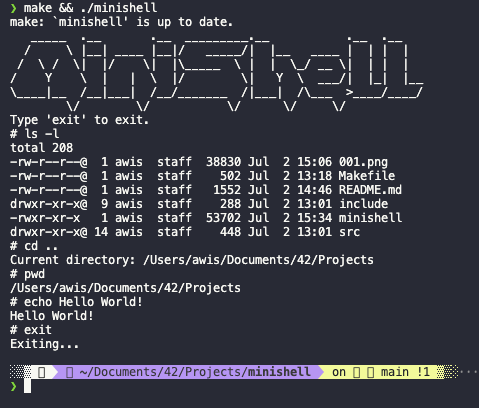

# Minishell (Work in Progress)


Minishell is a simple command-line interface program written in C. It provides a basic shell environment where users can enter commands and execute corresponding functions.

## Features
- Command execution: Users can enter commands such as `echo`, `pwd`, and `exit` to perform various operations.
- Argument parsing: The program parses the user's input and separates it into individual arguments.
- Basic error handling: The program handles errors gracefully, such as when a command is not recognized or when there is an issue retrieving the current working directory.

## Getting Started
To use Minishell, simply compile the source code and run the resulting executable. Follow the prompts to enter commands and observe the output.

```shell
gcc minishell.c -o minishell
./minishell
```

## Usage
1. Enter commands: Type commands such as `echo Hello, World!` or `pwd` and press Enter to execute them.
2. View output: The program will display the output of the executed command.
3. Exit: To exit the program, enter the `exit` command.

## Future Enhancements
- More commands: Expand the `cmd_table` array to include additional commands and their corresponding functions.
- Redirection and piping: Implement functionality to handle file redirection and command piping.
- Environment variables: Support environment variables and variable substitution.
